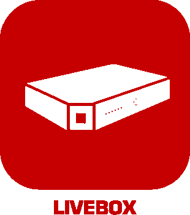

 

 

# Plugin Jeedom pour la box Internet Livebox Orange

Ceci est un plugin pour le système domotique Jeedom (https://www.jeedom.com) open source (https://github.com/jeedom) .

Il permet de contrôler la box Internet du founisseur d'accès Orange. Les modèles utilisés par Orange dans certains pays autre que la France ne sont pas supportés.

Le plugin a été développé à l'origine par Thomas Guenneguez.

Le plugin a été testé avec les Livebox version 2, Play, 4 et 5 (aussi appelée Livebox Fibre).

Pour signaler des problèmes, demander des conseils ou proposer des évolutions, utilisez le forum Communautaire Jeedom Catégorie Plugins -> Communication avec le tag "plugin-livebox". Merci