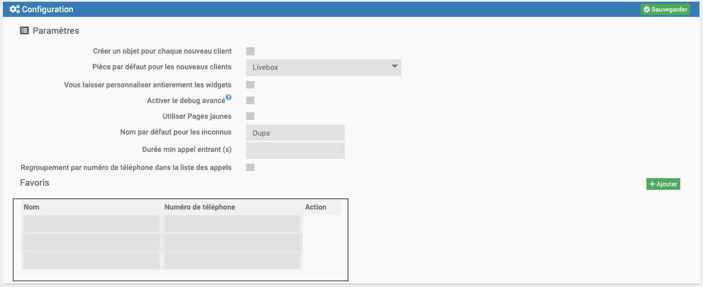
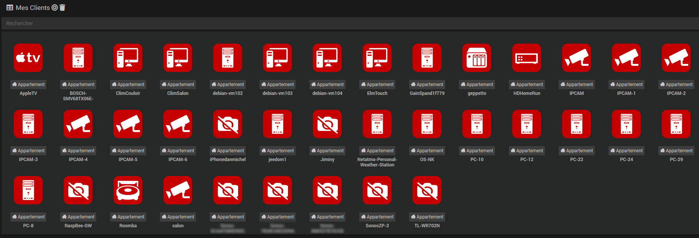
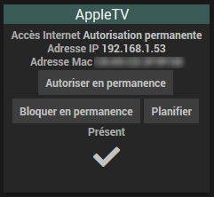
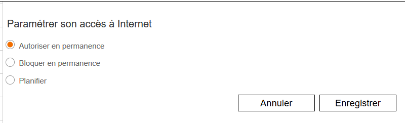

Présentation
===
Ce plugin permet de récupérer des informations de la Livebox et de lancer des actions.
Il a été développé à l'origine par Thomas Guenneguez.

La fonctionnalité de recherche du nom des appelants (***Utiliser Pages jaunes*** et ***Favoris***) est basée sur l'idée et le code de jpty qui en a aussi assuré le test.
Merci à lui pour toute l'aide apportée.

Compatibilité :
---

Le plugin a été testé avec les versions suivantes de la Livebox :
- Livebox 2
- Livebox 3 ou Play
- Livebox 4 (depuis la version du 09/12/2019)
- Livebox 5 ou Livebox Fibre (depuis la version du 13/12/2019)
- Livebox 6 (depuis la version du 28/03/2024)
- Livebox 7 (depuis la version du 28/03/2024)

Informations visibles :
---

- **Etat** : état de la Livebox
- **Etat synchro** : état de la synchronisation xDSL ou FTTH
- **Etat connexion** : état de la connexion internet (xDSL ou Fibre)
- **Etat TV** : état du service TV
- **Etat VoIP** : état du service téléphonie par internet
- **Etat Wifi** : état du service Wifi. état du service Wifi par fréquence 2.4Ghz et/ou 5Ghz et/ou 6Ghz
- **Etat Wifi invité** : état du service Wifi invité (à partir de la Livebox 4)
- **Liste des équipements**
- **Nombre des appels entrants**
- **Nombre des appels sortants**
- **Nombre des appels manqués**
- **Nombre total des appels**
- **Liste des appels entrants**
- **Liste des appels sortants**
- **Liste des appels manqués**
- **Liste des appels**
- **Numéro de téléphone** : numéro de téléphone VoIP
- **Débits descendant et montant** : débits de la liaison xDSL upload et download (pas compatible Fibre)
- **Marge de bruit descendant et montant** (pas compatible Fibre)
- **Durée de la synchronisation DSL** (pas compatible Fibre)
- **IP Wan** : adresse IP publique (IPv4)
- **IPv6 Wan** : adresse IP publique (IPv6)
- **Durée de fonctionnement**
- **Version software**
- **Dernier refresh**

Pour les 4 listes des appels un widget deroulant est disponible qui permet d'avoir une liste déroulante avec un ascenseur
pour limiter la place prise par la liste sur le dashboard.

Pour les widgets deroulant les paramètres optionnels suivants sont disponibles pour ajuster leurs dimensions (merci à Salvialf pour ce code)

**hauteurMax** : hauteur maximum en pixels. Valeur par défaut = 150

**largeur** : largeur en %. Valeur par défaut = 100

Dans la table **Liste des appels** un petit cœur (vert si vous avez activé les icônes colorées) permet d'ajouter un correspondant dans la liste des favoris s'il n'y est pas déjà
en indiquant au passage le nom sous lequel on souhaite voir listés ses appels. Attention cette fonctionnalité est dépendante du widget deroulant.
Si vous avez choisi un autre widget elle ne sera pas disponible.

Les paramètres suivants ne sont visibles que si le protocole VoIP était activé lors de la sauvegarde de l'équipement :
- Etat VoIP
- Numéro de téléphone
- nombre et tableau des appels entrants, sortants et manqués. Nombre total des appels.

Les paramètres suivants ne sont visibles qu'en connexion de type dsl ou vdsl :
- Débit montant
- Débit descendant
- Marge de bruit montant
- Marge de bruit descendant

Actions possibles :
---

- **Activation/Désactivation du WiFi** : permet d'activer ou de désactiver le WiFi. Pour Livebox 2 : uniquement le WiFi 2.4Ghz. Pour les autres Livebox : activation/désactivation par
fréquence WiFi (2.4Ghz et/ou 5Ghz et/ou 6Ghz)
- **Activation/Désactivation du WiFi invité** : permet (à partir de la Livebox 4) d'activer ou de désactiver le WiFi invité (les fréquences activées sont les mêmes que pour le WiFi privé)
- **Reboot** : permet de redémarrer la Livebox
- **Sonner** : permet de faire sonner votre téléphone VoIP pendant 5 secondes (pour tester le fonctionnement entre la Livebox et votre téléphone)

Installation/Configuration
===

Configuration du plugin
---

Dans la page de configuration du plugin apparait la section **Configuration**

- **Créer un objet pour chaque nouveau client** : Si cette option est cochée, le plugin ajoutera automatiquement les nouveaux clients découverts.
Le petit bouton en forme de cible décrit un peu plus loin permet de découvrir les nouveaux clients manuellement.

- **Pièce par défaut pour les clients** : Comme le plugin crée un objet pour chaque client connecté à la Livebox en filaire ou en Wifi, si votre réseau comporte beaucoup de clients il est
fastidieux d'avoir à placer chauqe objet client dans une pièce. Pour simplifier ce travail il est possible d'indiquer ici une pièce par défaut pour les nouveaux clients.

- **Vous laisser personnaliser entierement les widgets** : Si cette option n’est pas cochée, lors de la sauvegarde de l’équipement, l’ordre des commandes est réorganisé automatiquement.
Si elle est cochée, le plugin vous laisse réorganiser les commandes dans le widget.

- **Activer le debug avancé** : Si cette option est cochée, et si le plugin est en debug, cela ajoute les entêtes HTTP dans les logs.

- **Utiliser Pages jaunes** : Si cette option est cochée le plugin ira chercher sur le site Pages Jaunes le nom de l'appelant, s'il est disponible
Ceci ne marche bien sûr que pour un appel en France et le site répond "Oups" si le nom n'est pas disponible, par exemple si ce correspondant est sur liste rouge.
Le nom n'est recherché qu'une fois sur Pages jaunes, il est mémorisé dans la base de données de Jeedom.

- **Nom par défaut pour les inconnus** : Permet d'indiquer le nom des appels inconnus.

- **Durée min appel entrant (s)** : Les appels entrants dont la durée en secondes est inférieure à cette valeur seront considérés comme manqués.
Cela permet par exemple de considérer l'apel comme manqué si le correspondant raccroche dès qu'il constate qu'il est en ligne avec un répondeur.

- **Regroupement par numéro de téléphone dans la liste des appels** : Si cette option est cochée, les appels seront regroupés par numéro d'appel. Dans le cas de plusieurs
appels d'un même correspondant le nom et le numéro ne sont pas répétés dans la table.

- **Favoris** : Vous pouvez entrer dans ce tableau des noms et des numéros de téléphone associés. cela permet par exemple de personnaliser le nom d'un correspondant ("Frangin", "Jimmy", ...) 
ou d'indiquer un nom pour un correspondant étranger. Il y a un bouton pour ajouter une ligne ou supprimer un favori.
Si un numéro est dans les favoris, le nom associé a toujours priorité et Pages jaunes ne sera pas consulté pour ce numéro.
Il est possible d'utiliser les favoris même si **Utiliser Pages jaunes** n'est pas coché.

Attention ! N'oubliez pas de cliquer sur Sauvegarder pour que les favoris soient enregistrés.

Configuration de l'équipement Livebox
---

Nous allons maintenant paramétrer l'équipement. Pour ce faire, cliquer sur **Plugins / Communicaton / Livebox**

Puis définir :

- **Objet parent**
- **Catégorie** (optionnelle)
- **Activer** (coché par défaut)
- **Visible** (optionnel si vous ne désirez pas le rendre visible sur le Dashboard)
- **Auto-actualisation (cron)** : par défaut toute les minutes mais ajustable avec l'assistant cron disponible en cliquant sur (?)
- **Protocole de la Livebox** : par défaut HTTP ; ou HTTPS pour un accès distant
- **IP de la Livebox** : l'adresse IP (souvent 192.168.2.1) ; ou le nom de domaine pour un accès distant
- **Port de la Livebox** : le port 80 ; ou le port personnalisé pour un accès distant
- **Mot de passe de la Livebox**

Et pour finir, cliquer sur Sauvegarder

Si le plugin Agenda est installé et activé un onglet **Programmation** permet de programmer les commandes action du plugin dans un agenda et fournit leur liste s'il y en a.

Gestion des clients
---

Dans la page de l'équipement Livebox chaque client apparaît dans la section **Mes clients**. 

Le petit bouton en forme de cible permet de synchroniser le plugin avec la Livebox et de découvrir les nouveaux clients. 
Pour éviter de surcharger le Dashboard les nouveaux clients sont créés sous la forme d'un objet activé, non visible, et dans la pièce par défaut si vous en avez spécifié une dans la configuration du plugin.

Le petit bouton en forme de poubelle permet de supprimer les clients non actifs (c'est à dire ou la case Actif n’est pas cochée) **et de les ignorer lors des prochaines synchro**.
Cela permet d'avoir des clients "ignorés" qui n'apparaissent pas dans le plugin.

S'il existe des clients ignorés, un bouton **Ne plus ignorer les clients supprimés** apparaît dans la configuration du plugin et permet de cesser de les ignorer.

Commandes info disponibles pour les clients

- Accès internet
- Adresse IP
- Adresse MAC
- Dernier changement
- Dernière connexion
- Première connexion
- Présent (binaire)

Commandes action disponibles pour les clients

- Autoriser en permanence
- Bloquer en permanence
- Planifier

Ces trois commandes ont une action identiques aux 3 boutons disponibles dans l'administration de la Livebox pour chaque équipement sous la rubrique "Paramétrer son accès à Internet". 

Il faut noter la commande **Planifier** ne permet pas pour le moment de définir le planning d'activation. Vous devez définir ce planning dans l'administration de la Livebox.
La commande du plugin permet juste d'activer ce planning.

FAQ
===

*Pourquoi le plugin est gratuit ?*

Ce plugin est gratuit pour que chacun puisse en profiter simplement.

*J'aimerais remonter des erreurs/modifications directement dans le code ?*

C'est tout à fait possible via le forum communautaire Jeedom https://community.jeedom.com/ catégorie Plugins -> Communication. Créez un nouveau sujet et n'oubliez pas de lui ajouter le tag "plugin-livebox".

*Quelle est la fréquence de rafraîchissement des informations ?*

Le plugin actualise les informations toutes les minutes (modifiable avec le paramètre **Auto-actualisation (cron)** au niveau de la configuration de l'équipement Livebox)

*Est-il possible d'historiser les débits ?*

Pour historiser, il faut aller dans le menu Plugin => Communication => Livebox et activer l'historique sur les indicateurs comme pour n'importe quel indicateur.

*Est-ce compatible avec la fibre ?*

Oui

*Je n'ai pas d'information sur le débit, est-ce normal ?*

L'API de la Livebox en mode FTTH ne fournit pas le débit. Nous ne pouvons donc pas le récupérer.

*Le mot de passe que je saisis ne fonctionne pas.*

Le plugin ne supporte pas certains caractères spéciaux genre # et @.

*Je change de Livebox, faut-il faire quelque chose ?*

Il est nécessaire de sauvegarder à nouveau l'équipement Livebox pour que le plugin gère bien la détection du modèle.

*Pourquoi ces "Oups" dans la liste des appels ?*

C'est ce que répond Pages jaunes s'il ne peut révéler le nom du correspondant (liste rouge, ligne interne à une entreprise, ...).
Si vous connaissez le nom du correspondant vous pouvez l'indiquer en favori pour éviter le Oups.

*Sur Jeedom Smart comment faire pour que les dates des appels soient en français*

Malheureusement le package locale français ne semble pas installé sur Smart. Passez la commande sudo dpkg-reconfigure locales pour installer le package fr_FR.UTF-8.
La commande locale -a permet de lister les locales disponibles.
